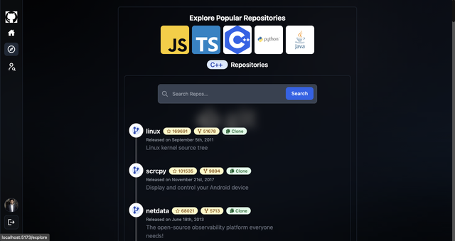
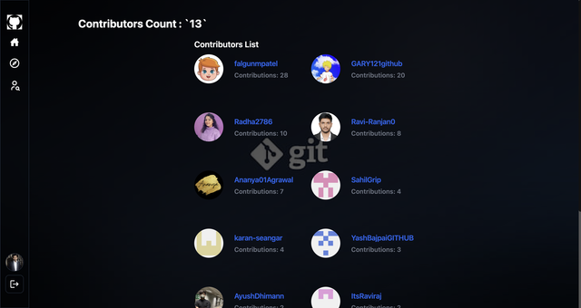

# CodeScout | React, MongoDB, Express.js, Passport.js

# Some Features:

- ⚙️ Tech stack: MERN + TailwindCSS + Github API
- 🔑 Authentication && Authorization with Passport.js (Github Auth)
- 👾 Fetch Github User Profiles and Repos
- 🚀 Filter Repos on the Client
- 👥 Check contributor list

## Preview

Here are some previews of the application:

### Dashboard Preview


### Popular Repositry



### Contributors Count



## Setup Instructions

### Backend Setup

1. Navigate to the `backend` folder:

   ```
   cd backend
   ```

2. Install dependencies:

   ```bash
   npm install
   ```

3. Start the backend server:

   ```
   npm start
   ```

   This will start the backend server on the specified port.

### Frontend Setup

1. Navigate to the `frontend` folder:

   ```
   cd frontend
   ```

2. Install dependencies:

   ```
   npm install
   ```

3. Start the frontend development server:

   ```
   npm start
   ```

   This will start the frontend server and open the application in your default web browser.

### Setup .env file (Backend Folder)

```js
PORT=5000
MONGO_URI=
GITHUB_API_KEY=
GITHUB_CLIENT_ID=
GITHUB_CLIENT_SECRET=
CLIENT_BASE_URL=
```
